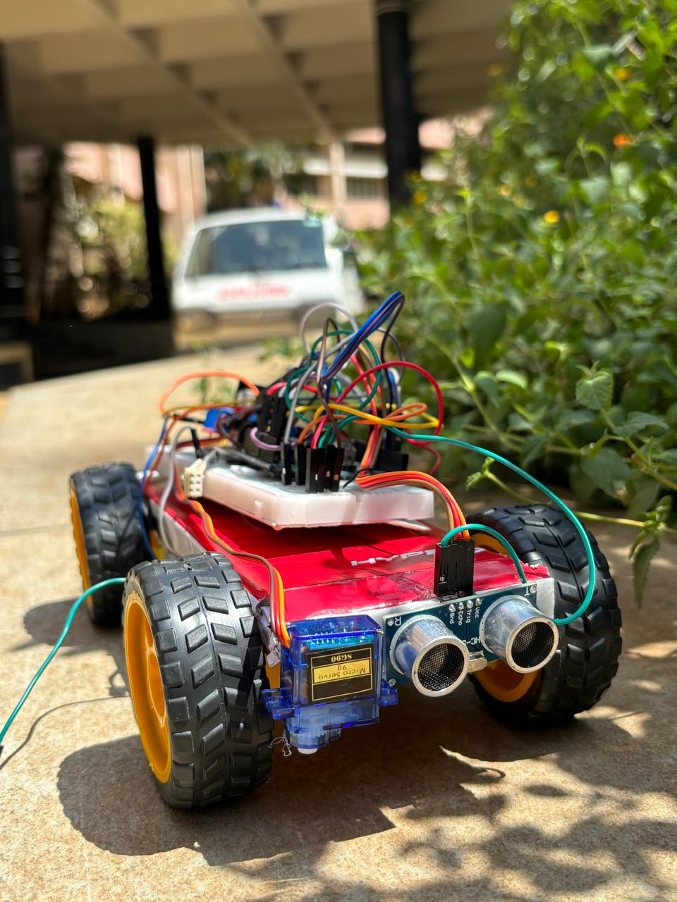

# Arduino-Based-Obstacle-Detector-and-Remover
Arduino-based obstacle detection and avoidance system using ultrasonic sensor and servo motor.
# Arduino-Based Obstacle Detector and Remover

An Arduino-based obstacle detection and avoidance system that detects obstacles using an ultrasonic sensor, scans the surroundings using a servo motor, and changes its movement direction accordingly.

## Features

- Obstacle detection using an ultrasonic sensor
- Servo motor based left-right scanning
- Distance comparison for obstacle avoidance
- Automatic movement direction control
- Arduino-based embedded system

## Technologies

- Embedded C
- Arduino
- Ultrasonic Sensor
- Servo Motor

## Project Image

## Project Files

- `obstacle_detector_remover.ino` – Arduino source code
- `roboticcar.jpeg` – Project image
- `working model.mp4` – Working demonstration video

## Working

1. The ultrasonic sensor detects the distance of nearby objects.
2. When an obstacle is detected, the servo motor rotates left and right to scan the surroundings.
3. The Arduino compares the detected distances.
4. The system changes the movement direction based on the available space.

## Project Demo

A working demonstration video is included in the repository.

## Note

This repository contains a recreated basic implementation of the project.
